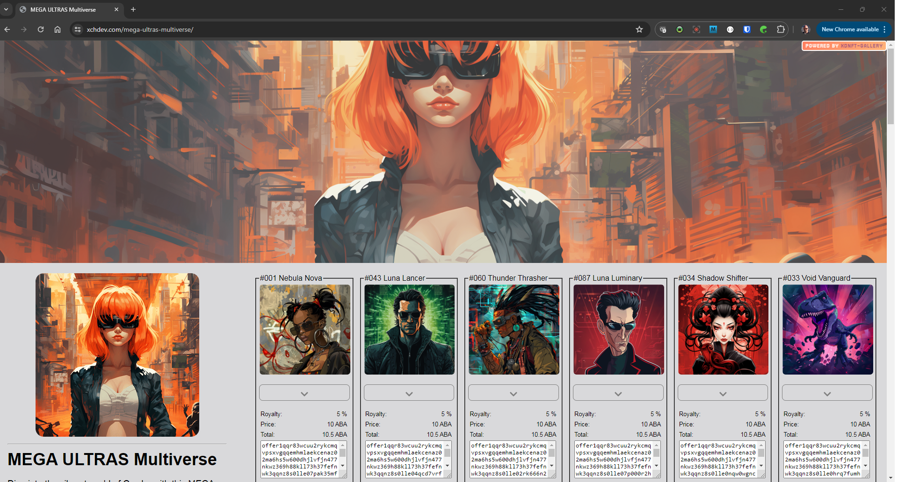

# xdnft-gallery

This Windows Powershell script will scan a folder with Offer files and build an NFT website for the offers. 

### Notes

* This is based off offer files, so you need to have offer files saved off on the local drive first.
* If MintGarden, Dexie support ABA also, need to add those in also.
* The script will download the full-size image and resize it to 200 pixels wide, keeping the aspect ratio. Then the page will use the smaller resized version as thumbnails and link to the original.
* The sequence of the functions does matter, so be warned before moving functions around. Some are setting global variable the when they run which other functions will need.

### User Config

* Need to set the Spacescan URL at the top of the script. This will be different depending on the blockchain.
* The collectionID function at the top of the script relys on my own XCHDEV API. You can bypass this by changing "YOUR_COLLECTION_ID" in the return statement. You'll need to uncomment by removing the hashtag '#' and then comment out the existing return by adding a hashtag before "return $response.col_id"
* All of the CSS is in one spot so it can be updated as desired.
* For now, you will need to update the script based on whether you are running for Chia or ABA. There are a number of CLI commands which you can search `aba ` and replace with `chia `. Notice I including a single space in the search and replace terms.

### Output

The script will create an `index.html` file in the output folder you are prompted for when the script runs. If the folder does already exist it will get created. All the images for the NFT will allow be downloaded and a resized version stored in that same folder. So, you will have all the necessary website files all in one, easy to upload folder.

### Running the script

```PowerShell
.\xdnft-gallery.ps1
```

### Demo

Here is a demo posted on X (Twitter) of running the script. https://x.com/steppsr/status/1785173812847296764

### Example of Site

[MEGA ULTRAS Multiverse](https://xchdev.com/mega-ultras-multiverse)



#### _All works created by Steve Stepp_

---

### Want to help support?

| Blockchain | Address |
| ---------- | ------- |
| Chia (XCH) | xch1xz9g7cyy79vnrh6nuyh86jq4ps6ah2ny0ck2050wfqqfjwkyk0mqd89etp |
| ABA (ABA) | aba1qje9cx2lfujrqthl9gxg4sdpa8d2evur6kz95mavmnnvwcn6eyys9qz43c |
| Bitcoin (BTC) | 3ADGMs1i6MU8Bxnr8qC6CPmgTUAS6DevyT |
| Etherium (ETH) | 0x1F604e5a010f42F36e0C24868454f08056bc5B0A |
